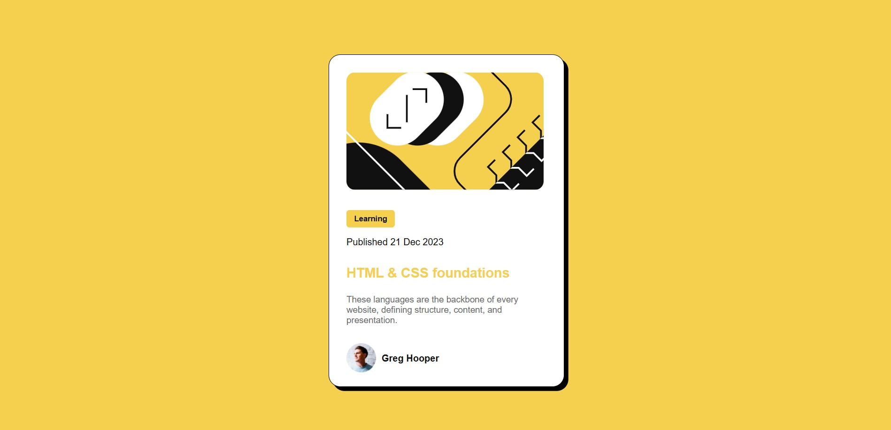

# Blog preview card

## Overview

### Links

- Live Site URL: (https://hastigholami.github.io/blog-preview-card/)
- Solution URL: (https://github.com/hastigholami/blog-preview-card)

### Built With

- HTML
- CSS 

## My Process

### What I Learned

In this project, I practiced:
- Using 'flexbox' to create flexible and responsive layout
- Key Flexbox properties: 
'display: flex;' , 'justify-content' , 'align-items'

### Continued Development

Next, I want to:
- Improve my CSS skills
- Start learning JavaScript
- Complete more Frontend Mentor challenges

## Author

- GitHub – (https://github.com/hastigholami)
- Frontend Mentor – (https://www.frontendmentor.io/profile/hastigholami)
- LinkedIn – (https://www.linkedin.com/in/hastigholami/)

## Acknowledgments

Thanks to [Frontend Mentor](https://www.frontendmentor.io) for the amazing challenges!

## Note

This project was originally completed in April 2025. This README was updated later for better clarity and documentation.
